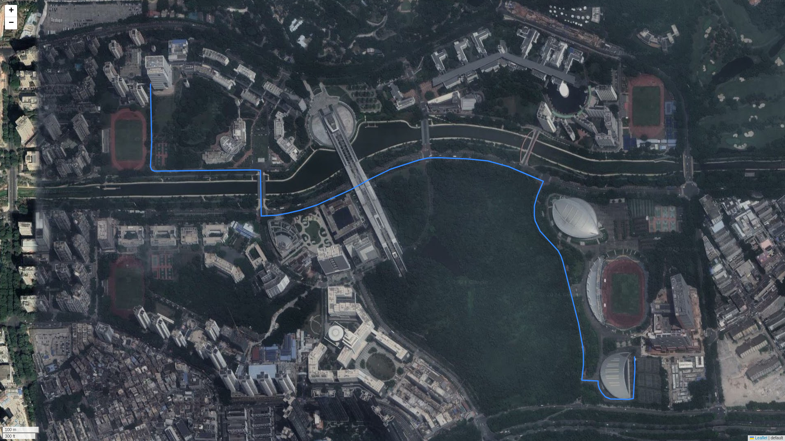
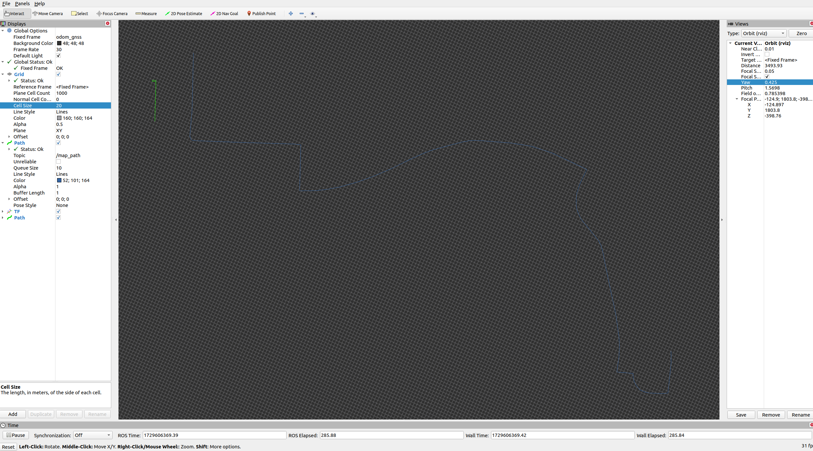

# bynav_ros_tool
A ros pachage to use bynav X1-6H in ros1 noetic 




## Platform
- Ubuntu 20.04
- ROS noetic
- python 3.8

## Install

gps driver
```shell
sudo apt install libgps-dev
```

python requirements
```shell
pip install -r requirements.txt
```

## Usage

**Always check the ttyUSB* port before run the launch file**
```
sudo chmod 777 /dev/ttyUSB*
```

start device via roslaunch

```shell
roslaunch bynav_ros_driver connect_tty.launch
```

## Parameters

- check **imu** parameters in `std_driver_config.xml`
- check **ntrip** parameters in `ntrip_parameters.yaml` 